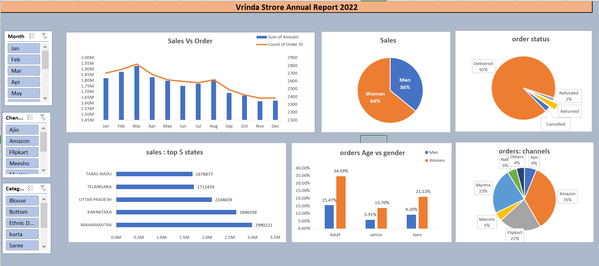

# Sales-Insight-Dashboard

## Project Overview
This project presents a comprehensive dashboard analyzing retail sales data for the year 2022 for Vrinda Store. It provides interactive visualizations to understand customer trends and inform strategies for increased sales performance in 2023. Project involves data cleaning, processing, analysis and dashboard creation in Excel.

Project

## Features
- **Interactive Excel Dashboard**: Clickable slicers to filter data across multiple parameters.
- **Orders vs. Sales Visualization**: A dual-axis chart showing the relationship between the number of orders and total sales value.
- **Sales Composition Analysis**: Pie charts breaking down sales by gender and order status.
- **Sales by Top States**: A bar chart showcasing the top five states by sales volume.
- **Customer Demographics**: Analysis of order distribution by age and gender.
- **Sales Channel Breakdown**: Pie chart demonstrating the market share of each sales channel.

## Skills Demonstrated
- Deriving Insights and Formulating Strategic Recommendations
- Data cleaning, processing, and validation to ensure accuracy
- Analyzing data with pivot tables and advanced filtering techniques
- Visualizing data with conditional formatting and dynamic charts
- Creating interactive dashboards with slicers for report generation
- Extracting strategic insights to inform business decisions

## Key Performance Indicators (KPIs)
- Sales and orders comparison chart
- Peak months for sales and orders
- Sales distribution by gender
- Overview of order statuses
- Top 10 states by sales volume
- Correlation between age, gender, and order count
- Leading sales channels
- Bestselling product categories

  ## Project Insights
- Women make up approximately 65% of our customer base, outpurchasing men.
- Maharashtra, Karnataka, and Uttar Pradesh are the frontrunners in product purchases.
- The adult demographic (30-49 years) leads our customer segments, contributing to around 50% of purchases.
- Amazon, Flipkart, and Myntra emerge as the top channels through which customers place the majority of orders.
